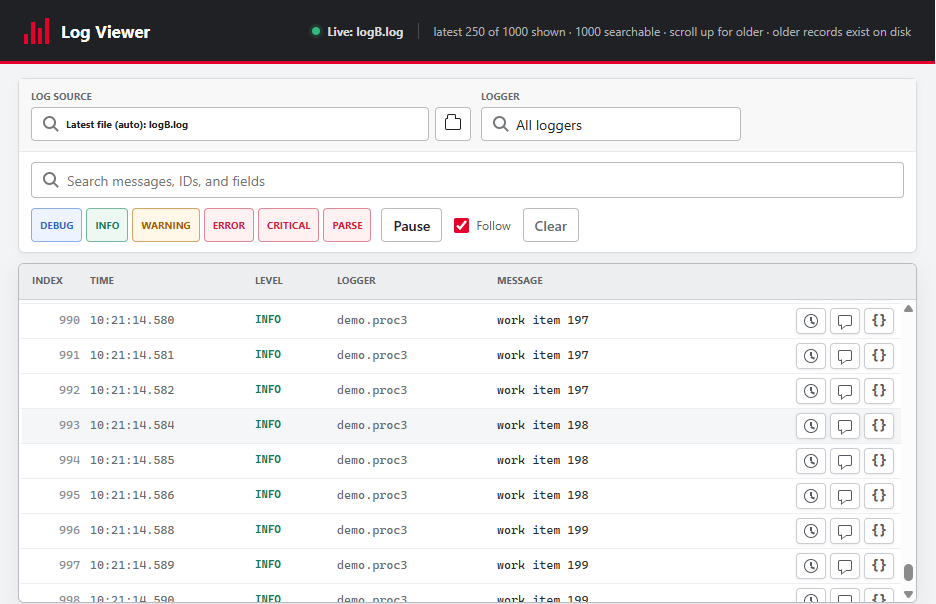

# GlitchyLogger

Process-safe and thread-safe Python logging with JSON Lines output and a log file
that can be switched while the application is running.

GlitchyLogger uses one listener thread and one file handle. Threads and child
processes send records through a shared queue, avoiding competing writes to the
same file.

An optional authenticated [browser log viewer](docs/log-viewer.md) provides
live JSONL updates, filtering, source selection, and an admin session dashboard.

<p align="center">
	
</p>

## Requirements

- Python 3.11 or newer
- No runtime dependencies

## Install

Install a tagged release directly from GitHub:

```bash
python -m pip install "glitchylogger @ git+https://github.com/glitchyordis/glitchylogger.git@v0.1.0"
```

In another project's `pyproject.toml`, pin the same tag for reproducible builds:

```toml
[project]
dependencies = [
	"glitchylogger @ git+https://github.com/glitchyordis/glitchylogger.git@v0.1.0",
]
```

To upgrade later, change the tag and reinstall the consuming project. Pin a tag
or commit in deployed applications; tracking `main` makes builds non-reproducible.

For local development across two repositories:

```bash
python -m pip install --editable ../glitchylogger
```

## Basic usage

```python
from glitchylogger import LoggerConfig, configure_logging, get_logger, shutdown_logging

configure_logging(LoggerConfig(file_path="logs/app.jsonl", level="INFO"))
log = get_logger(__name__)

try:
	log.info("application started")
finally:
	shutdown_logging()
```

Applications configure and shut down logging. Library modules should only call
`get_logger(__name__)`.

## Child processes

Pass the logging handle to processes created by your application:

```python
from concurrent.futures import ProcessPoolExecutor

from glitchylogger import configure_worker, get_logging_handle

handle = get_logging_handle()
with ProcessPoolExecutor(
	initializer=configure_worker,
	initargs=(handle,),
) as pool:
	...
```

See `examples/multiprocessing_demo.py` and `examples/fastapi_app.py` for complete
examples, including runtime file switching and request context.

## Live browser viewer

The optional viewer presents the existing JSON Lines file as readable columns
with live updates, text search, level and logger filters, and expandable record
details. It only reads the file; the logging format and writer are unchanged.

See the [Log Viewer Guide](docs/log-viewer.md) for complete launch, LAN access,
usage, security, and troubleshooting instructions.

Install the viewer dependencies on the computer running the application:

```bash
python -m pip install --editable ".[viewer]"
```

On Windows, securely prompt for the viewer and admin tokens once. They are
stored in Windows Credential Manager for the current Windows account:

```powershell
glitchylogger-store-viewer-secrets
```

Enter the shared viewer password at `Viewer token:` and a different privileged
password at `Admin token:`. Input is hidden. If the setup command is not
recognized after updating the source, reinstall the editable package with the
viewer extra using the command above, or run:

```powershell
python -c "from glitchylogger.viewer import store_credentials; store_credentials()"
```

Then start the viewer on the log directory. Binding to `0.0.0.0` makes it
reachable from other computers on the LAN:

```powershell
glitchylogger-viewer --directory C:\ProgramData\MyApp\logs --host 0.0.0.0
```

Environment variables override stored credentials, and explicit token options
override both. On the other computer, open `http://LOGGER-PC:8765` and enter
the same viewer token; administrators still enter the separate admin token at
`http://LOGGER-PC:8765/admin`. The tokens are shared role credentials rather
than individual user accounts.
By default, the viewer loads up to the latest 1,000 complete records and then
displays new records as they are appended. It renders the newest 250 matches
first; scroll upward to load older retained rows in batches of 250. The counter
reports when still older records exist on disk outside the browser's searchable
history window.

`Latest file (auto)` follows the most recently modified `.log` or `.jsonl`
file, including files created by `set_log_file()`. The file selector can instead
pin the stream to any listed file in that directory.
The folder button can browse and switch directories on the logging host while
the viewer is running. A browser-native folder picker would browse the remote
user's computer instead of the logging host.
Directory and file choices are independent per browser tab, so multiple users
can follow the same or different files concurrently and all receive live
updates for their selected file.
Closing a tab cancels its server stream and releases its follower and request
state. Log files are opened only during reads rather than held open per user.
For abrupt network loss, an SSE heartbeat sent about every 15 seconds helps the
server detect and remove stale connections.

Administrators can open `http://LOGGER-PC:8765/admin` and authenticate with the
separate admin token. The dashboard shows connection and interaction-idle
durations, client/source details, and a control to disconnect an individual
viewer stream or all active streams. The viewer and admin tokens must not match.
Bulk disconnect stops live updates but does not revoke the shared viewer token;
users who retain it can reload and reconnect.

Running the setup command again replaces both stored tokens. Stop every old
viewer process and restart the server afterward because each running process
keeps the tokens it loaded at startup. Launch without `--token` or
`--admin-token` when you intend to use the stored values.

Run `python -m pytest tests/test_viewer.py -q` to validate viewer tailing,
reconnects, concurrent streams, authentication, activity tracking, and admin
disconnect controls.

For a single fixed file with no selector, use `--file` instead of `--directory`.

Allow TCP port 8765 only on the Windows Private network. The bearer token is
sent over plain HTTP, so this setup is intended for a trusted LAN. Use HTTPS or
a VPN on an untrusted network or across the internet.

Uvicorn's `--workers N` processes are created outside the application, so they
cannot share this in-process queue. Use one Uvicorn worker, or assign each worker
its own log file.

### Forking on POSIX

`configure_logging()` starts a listener thread and a `multiprocessing.Manager`
process, so the configuring process is multi-threaded from then on. Python 3.12
and newer raise a `DeprecationWarning` when such a process calls `fork()`, and
because `capture_warnings` is on by default that warning is written to the log
file like any other record. Prefer the `spawn` or `forkserver` start method, fork
your workers before configuring logging, or set `capture_warnings=False` if the
noise is unwanted.

## Development and releases

Development dependencies are defined in `pyproject.toml`; there is no separate
requirements file. The `test` extra installs the test suite dependencies, while
`dev` adds the build, publishing, release, and example-server tools. Install both
for a complete contributor environment:

```bash
python -m pip install --editable ".[test,dev]"
python -m pytest
python -m build
python -m twine check dist/*
```

Work on a branch and record every user-visible change under `## [Unreleased]` in
`CHANGELOG.md`, in the same commit as the code. Release from `main` once the
changes are merged:

```bash
bump-my-version bump patch      # or minor / major / --new-version X.Y.Z
git push --follow-tags
```

That single command rewrites the version in `pyproject.toml`, promotes the
`Unreleased` section of `CHANGELOG.md` to the new version, commits, and creates
the matching `vX.Y.Z` tag. Add `--dry-run --verbose` to preview it first.

The package can also be uploaded to PyPI from the generated files in `dist/`.

## License

MIT
